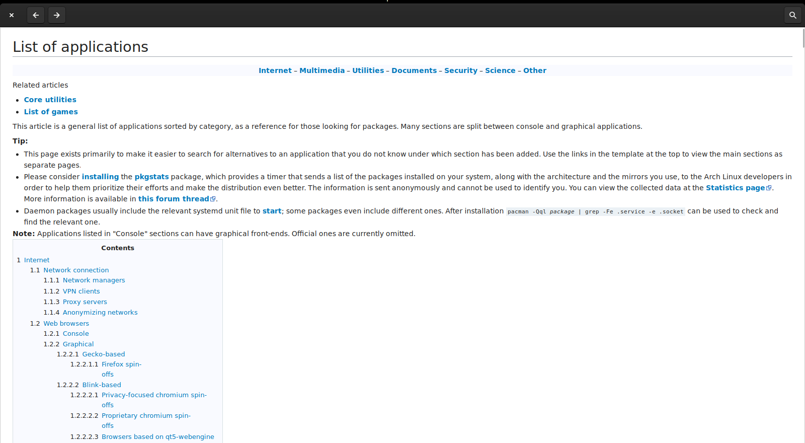
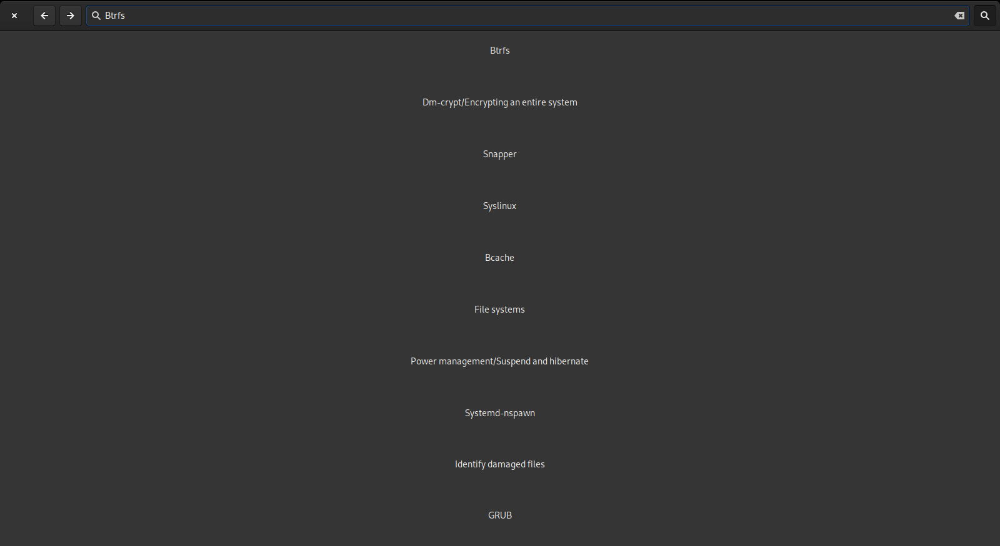

# NAWVi - The Native Arch Wiki Viewer


There is a great package in the Arch Linux repos: `arch-wiki-docs` which allow viewing of the pages of the wiki locally. However, while this is a great resource, sometimes I'm not actively in the terminal (Shocking, I know), and just want to quickly look something up in a dedicated gui. Enter NAWVi. It is basically a front-end for the `wiki-search-html` tool provided by `arch-wiki-docs`. It is powered by Gtk, WebKitGtk, and written in Vala.

### To install :

This tool is built specifically for [Arch Linux](https://www.archlinux.org) because it relies on a packages which, to my knowledge, is only in the Arch repos, as it is a pretty distro-specific application. Also note that it has __only been tested on the latest builds of Arch, and all the packages that entails.__ ~~I am working on a `PKGBUILD` for the AUR but haven't quite gotten there yet.~~  I'm currently searching for an icon to use. To make it available for not arch based distributions I plan on making it into a [flatpak](https://www.flatpak.org/), but that is definitely a little ways away (and I wouldn't be made if anyone else made it into a snap or appimage).

#### With the PKGBUILD: (will be posted to the AUR after I figure out the icon situation...):
- Download the [PKGBUILD](./PKGBUILD/PKGBUILD) 
- Run `makepkg -si` to install the dependencies and build


#### Building from source
You'll need the following dependencies to install (given by name in the repo's ):
- meson
- ninja
- webkit2gtk
- gtk3
- arch-wiki-docs
- libgee

##### Build instructions: 
``` bash
$ meson build --prefix=/usr
$ cd build
$ ninja 
$ sudo ninja install 
```

### To-do List:
- [ ] Add bookmark functionality
- [ ] Get icon
- [ ] Flatpak support
- [ ] Revamp search engine (i.e. become self sufficient)
- [ ] Redesign what the search looks like
- [ ] Update as you type (***must*** have faster search for this)


## Screenshots:

